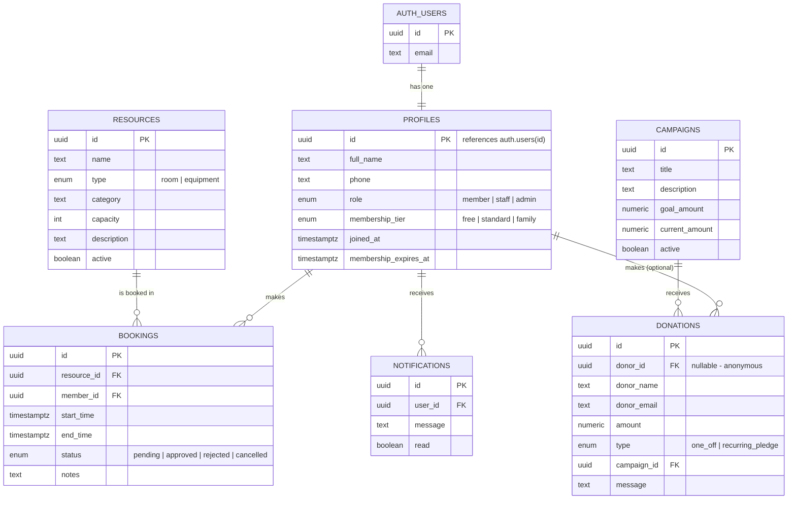

# Entity Relationship Diagram

Renders as a diagram on GitHub, or paste into https://mermaid.live to view.

## Notes on key design decisions

- **`profiles.id` is a foreign key to `auth.users.id`**, not an independent
  primary key — this is the standard Supabase pattern. A trigger
  (`handle_new_user`) creates the profile row automatically on signup, so the
  app never has to do it manually.
- **`bookings` has a database-level exclusion constraint** (not shown in the
  ER diagram's cardinality, since it's a constraint rather than a
  relationship) preventing two `approved` bookings from overlapping on the
  same resource — this is what makes double-booking prevention race-safe
  rather than just a UI check.
- **`donations.donor_id` is nullable** to support anonymous donations, with
  `donor_name`/`donor_email` captured as free text instead when there's no
  account.
- **`campaigns.current_amount` is derived**, kept in sync by a trigger that
  fires on every donation insert — the frontend never has to sum donations
  itself.
